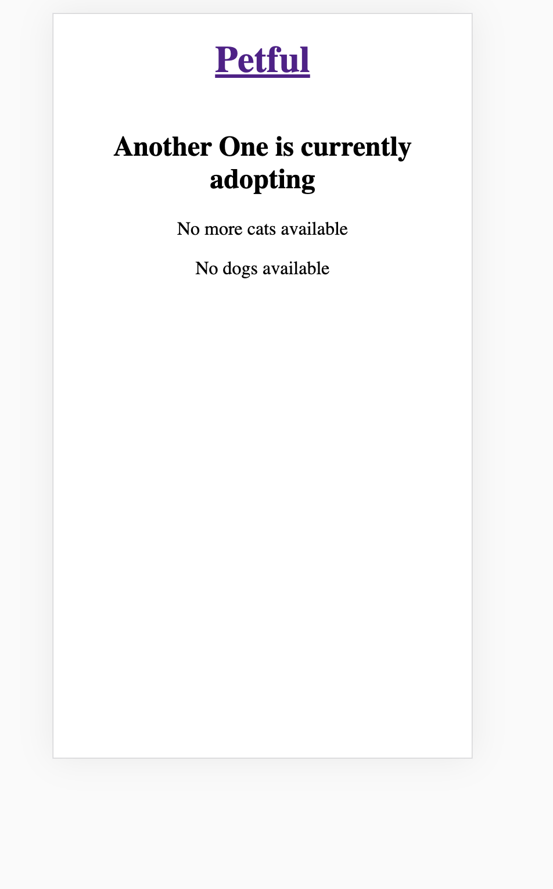
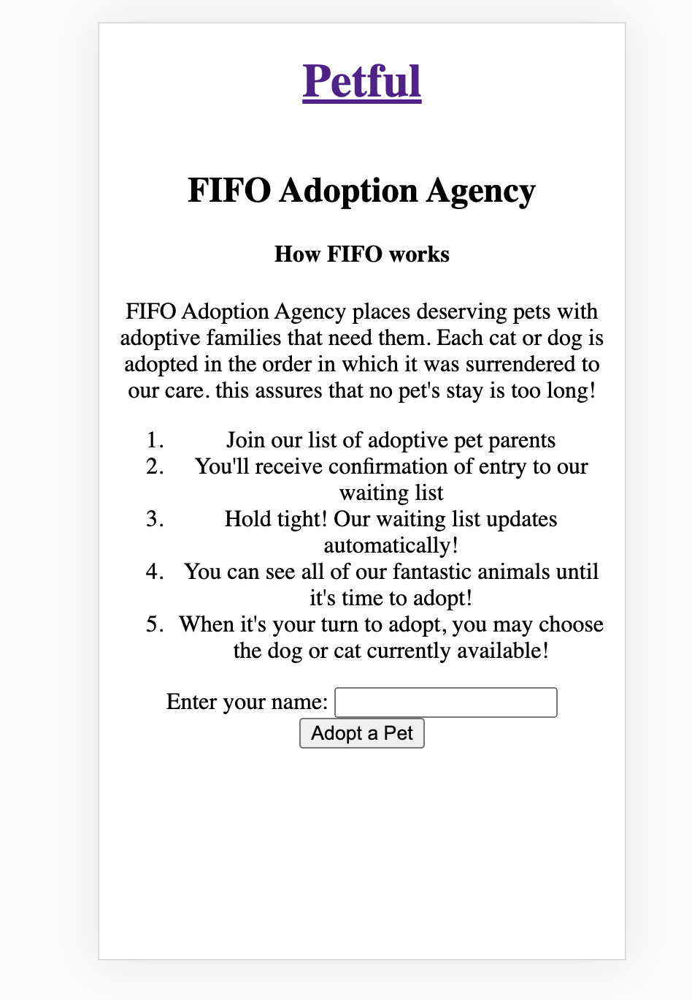
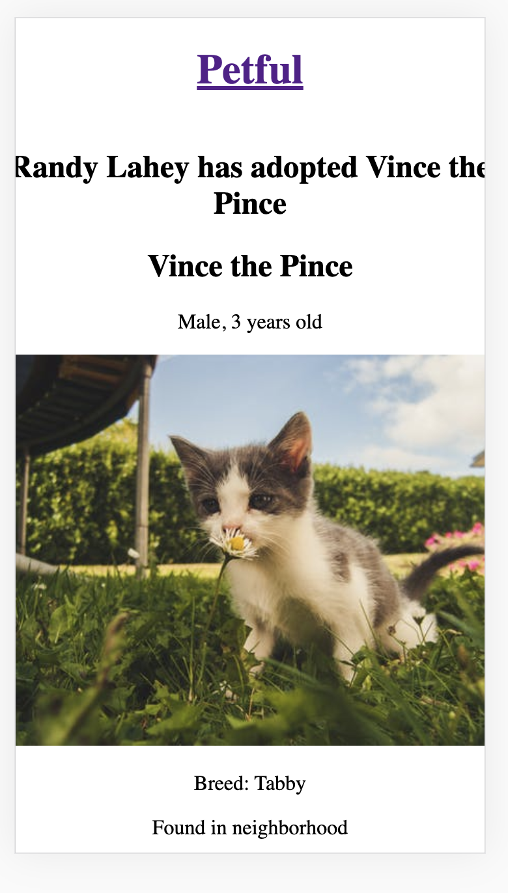
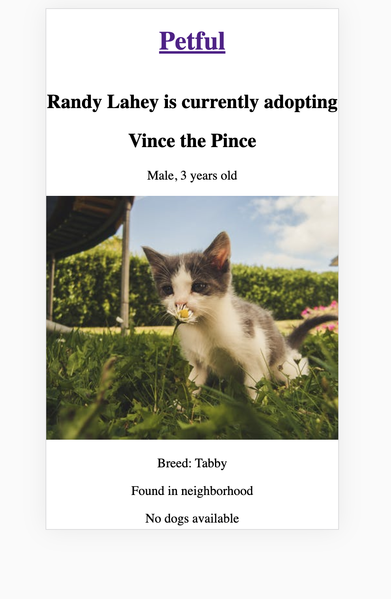

### `App Name: Petful`
Deployed: https://petful-virid.vercel.app/
Client repo: https://github.com/thinkful-ei-quail/petful-frontend-zenzi-kameron
API repo: https://github.com/thinkful-ei-quail/petful-zenzi-kameron

### `Co-Developers: Kameron Masullo and Zenzi Ali`

Petful is an app that allows users to adopt cats and dogs after entering their name. Users may only adopt the cat or
dog that has been housed by our organization the longest. Users may
view all our entire inventory of pets and see details about each cat
or dog.
Select the adopt button when you are 1st in our waiting list.

### `Technology Used:`
This project uses Node.js,
React.js (client-side)Express, and JavaScript.
The project also relies on JavaScript Queue structure with
JS algorithms for making endpoint requests.

### `SCREENSHOTS`

